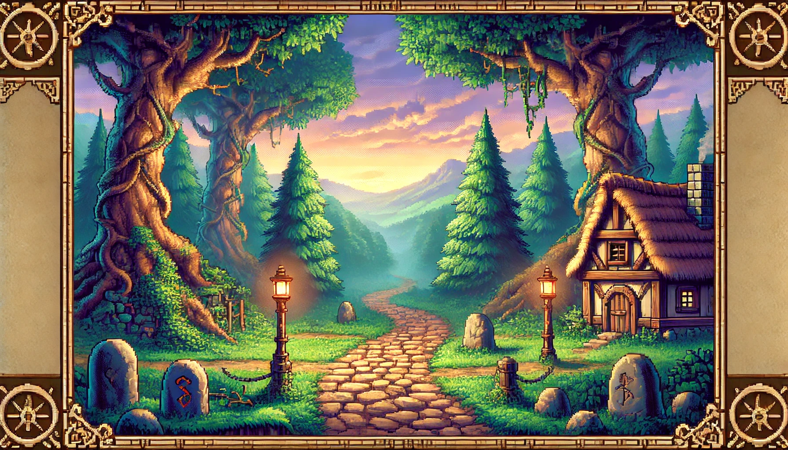

# D&D Deckbuilder



D&D Deckbuilder is a roguelike deck-building game implemented in Python using the Pygame library. Battle through a dungeon, defeat monsters, and build your deck as you progress!

## Table of Contents
1. [Installation](#installation)
2. [How to Play](#how-to-play)
3. [Game Mechanics](#game-mechanics)
4. [Controls](#controls)
5. [File Structure](#file-structure)
6. [Contributing](#contributing)

## Installation

1. Ensure you have Python 3.7+ installed on your system.
2. Install Pygame by running:
   ```
   pip install pygame
   ```
3. Clone this repository or download the source code.
4. Navigate to the game directory in your terminal.
5. Run the game using:
   ```
   python3 deck_builder.py
   ```

## How to Play

1. Start the game by running `deck_builder.py`.
2. You'll begin with a basic deck of cards.
3. Each turn, draw cards from your deck and use them to attack monsters, gain shields, or heal.
4. Defeat monsters to progress through dungeon levels and increase your score.
5. After defeating a monster, choose a new card to add to your deck from a selection of three random cards.
6. The game ends when your health reaches 0.

## Game Mechanics

- **Cards**: Each card has various effects such as dealing damage, providing shields, healing, or drawing more cards. Cards now have visual icons representing their attributes.
- **Energy**: You have a limited amount of energy each turn to play cards. Your energy is represented by a blue bar.
- **Health**: Your health is represented by a green bar. The monster's health is represented by a red bar.
- **Monsters**: Each monster has unique health and damage values. Some are tougher than others!
- **Dungeon Levels**: As you progress, monsters become stronger, but so do you!
- **Deck Building**: After each victory, choose a new card to add to your deck from a selection of three, making your character stronger.
- **Card Rarity**: New cards have different rarities, affecting how often they appear as choices after a victory.

## Controls

- **Mouse**: Click on cards to select them, click again to play them. Click on "End Turn" or "Discard" buttons.
- **Number Keys (1-0)**: Quickly select and play cards in your hand.
- **E**: End your turn.
- **Number Keys (1-3)**: Select a new card after defeating a monster.
- **Space**: Skip adding a new card to your deck after a victory.

## File Structure

```
D&D_Deckbuilder/
│
├── deck_builder.py
├── README.md
├── images/
│   ├── background.png
│   ├── player.png
│   ├── goblin.png
│   ├── orc.png
│   ├── troll.png
│   ├── dragon.png
│   ├── witch.png
│   ├── attack.svg
│   ├── shield.svg
│   ├── heal.svg
│   ├── energy.svg
│   └── dice.svg
```

## Graphics

The game now features a beautiful fantasy background image (background.png) that sets the mood for your dungeon-crawling adventure. Card attributes are represented by SVG icons for better visual clarity.

## Contributing

Contributions are welcome! Please feel free to submit a Pull Request.
